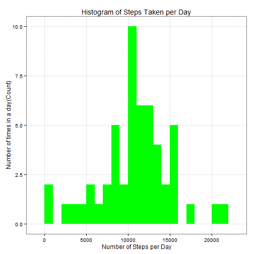
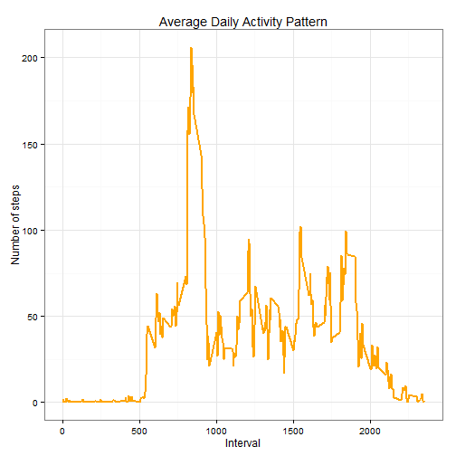
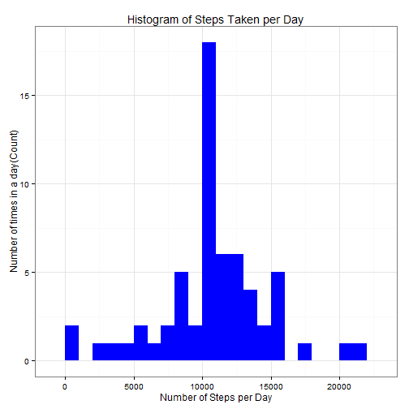
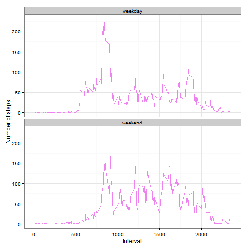

```r
echo = TRUE  # Always make code visible
options(scipen = 1)  # Turn off scientific notations for numbers
library(data.table)
```

```
## data.table 1.9.4  For help type: ?data.table
## *** NB: by=.EACHI is now explicit. See README to restore previous behaviour.
```

```r
library(ggplot2) # use ggplot2 for plotting figures
```

<h1>Loading and preprocessing the data</h1>

This assignment makes use of data from a personal activity monitoring device. This device collects data at 5 minute intervals through out the day. The data consists of two months of data from an anonymous individual collected during the months of October and November, 2012 and include the number of steps taken in 5 minute intervals each day. 

This assignment instructions request to show any code that is needed to loading and preprocessing the data, like to: <br>
1.Load the data 

2.Process/transform the data 

Load the required data

The following statement is used to load the data using read.csv().


```r
rdata <- read.csv('activity.csv', header = TRUE, sep = ",",
                  colClasses=c("numeric", "character", "numeric")) 
                  ##assuming activity.csv is in the working directory
```

Tidy the data 


```r
rdata$date <- as.Date(rdata$date, format = "%Y-%m-%d")
rdata$interval <- as.factor(rdata$interval)

str(rdata)
```

```
## 'data.frame':	17568 obs. of  3 variables:
##  $ steps   : num  NA NA NA NA NA NA NA NA NA NA ...
##  $ date    : Date, format: "2012-10-01" "2012-10-01" ...
##  $ interval: Factor w/ 288 levels "0","5","10","15",..: 1 2 3 4 5 6 7 8 9 10 ...
```

What is mean total number of steps taken per day?


```r
steps_per_day <- aggregate(steps ~ date, rdata, sum)
colnames(steps_per_day) <- c("date","steps")
head(steps_per_day)
```

```
##         date steps
## 1 2012-10-02   126
## 2 2012-10-03 11352
## 3 2012-10-04 12116
## 4 2012-10-05 13294
## 5 2012-10-06 15420
## 6 2012-10-07 11015
```

<h1>Histogram of the total number of steps taken per day.</h1>

 


<h1>Calculate the mean and median of the number of steps taken per day</h1>


```r
steps_mean   <- mean(steps_per_day$steps, na.rm=TRUE)
steps_median <- median(steps_per_day$steps, na.rm=TRUE)
```

The mean is 10766.189 and median is 10765.

What is the average daily activity pattern?

Calculate the aggregation of steps by intervals of 5 minutes and convert the intervals as integers and save them in a data frame called steps_interval.


```r
steps_interval <- aggregate(rdata$steps, 
                                by = list(interval = rdata$interval),
                                FUN=mean, na.rm=TRUE)
#convert to integers

steps_interval$interval <- 
        as.integer(levels(steps_interval$interval)[steps_interval$interval])
colnames(steps_interval) <- c("interval", "steps")
```

Time series of the average number of steps taken (averaged across all days) versus the 5 minute intervals:

 

Find the 5 minute interval with the containing the maximum number of steps:


```r
max_interval <- steps_interval[which.max(  
        steps_interval$steps),]
```

The 835th interval has maximum 206 steps.

<h1>Inputing missing values</h1>

Total number of missing values:


```r
missing_vals <- sum(is.na(rdata$steps))
```

The total number of missing values are 2304.

Fill in all of the missing values in the dataset:


```r
na_fill <- function(data, pervalue) {
        na_index <- which(is.na(data$steps))
        na_replace <- unlist(lapply(na_index, FUN=function(idx){
                interval = data[idx,]$interval
                pervalue[pervalue$interval == interval,]$steps
        }))
        fill_steps <- data$steps
        fill_steps[na_index] <- na_replace
        fill_steps
}

rdata_fill <- data.frame(steps = na_fill(rdata, steps_interval),  
        date = rdata$date,  
        interval = rdata$interval)
str(rdata_fill)
```

```
## 'data.frame':	17568 obs. of  3 variables:
##  $ steps   : num  1.717 0.3396 0.1321 0.1509 0.0755 ...
##  $ date    : Date, format: "2012-10-01" "2012-10-01" ...
##  $ interval: Factor w/ 288 levels "0","5","10","15",..: 1 2 3 4 5 6 7 8 9 10 ...
```
We check that are there any missing values remaining or not

```r
sum(is.na(rdata_fill$steps))
```

```
## [1] 0
```

Zero missing values.

<h1>Total number of steps taken each day</h1>

Bin interval is 1000 steps.

 

Calculate and report the mean and median total number of steps taken per day:


```r
steps_mean_fill   <- mean(fill_steps_per_day$steps, na.rm=TRUE)
steps_median_fill <- median(fill_steps_per_day$steps, na.rm=TRUE)
```

The mean is 10766.189 and median is 10766.189.

Do these values differ from the estimates from the first part of the assignment?

Yes, these values do differ slightly.

What is the impact of imputing missing data on the estimates of the total daily number of steps?


Before :<br>
Mean : 10766.189
Median: 10765


After filling in missing data:<br>
Mean : 10766.189
Median: 10766.189 - the mean and median are equal

<h1>Are there differences in activity patterns between weekdays and weekends?</h1>

Subset the table into two parts - weekends (Saturday and Sunday) and weekdays (Monday through Friday).Plot the two data sets side by side for comparison. 
 


Plot comparing the average number of steps taken per 5-minute interval across weekdays and weekends:

 


